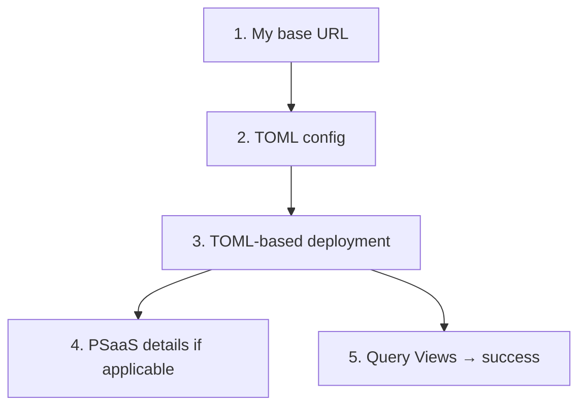
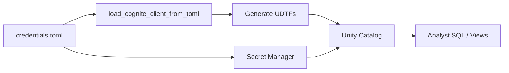

# CDF base URL and TOML deployment

How to identify your CDF **base URL**, configure **TOML**, and deploy **cognite-databricks** / **cognite-pygen-spark**. Applies to **all** customers.

## How this guide fits together

| Step | Your question | Section |
| --- | --- | --- |
| 1 | **I need my base URL** | [I need my base URL](#1-i-need-my-base-url) |
| 2 | **I need TOML** | [I need TOML](#2-i-need-toml) |
| 3 | **How do I do TOML-based deployment?** | [TOML-based deployment](#3-toml-based-deployment) |
| 4 | **What does PSaaS base URL mean?** | [What PSaaS base URL means](#4-what-psaas-base-url-means) |
| 5 | **(Databricks) Did deployment succeed?** | [Verify deployment (Databricks)](#5-verify-deployment-databricks) |



**Roles on Databricks:**

- **Platform admin** — looks up base URL, creates TOML, runs provisioning once (Secret Manager, View registration).
- **Analyst** — queries **Views** only. No TOML, no UDTF calls, no secrets in notebooks.

---

## 1. I need my base URL

Every customer must know the **Cognite API URL** their project uses before deploying. A CDF project lives on one cluster; that cluster has a specific hostname for API traffic.

See [Clusters and regions](https://docs.cognite.com/cdf/admin/clusters_regions#clusters-and-regions). There are three deployment models:

| Deployment | Where to find your base URL |
| --- | --- |
| **Multi-tenant** | [Multi-tenant clusters table](https://docs.cognite.com/cdf/admin/clusters_regions#cognite-multi-tenant-clusters) — **Cognite API URL** column |
| **Dedicated** | Cognite-provided hostname (not on the public list) |
| **PSaaS / Private Link** | Cognite-provided Private Link hostname via your VPN — [§4](#4-what-psaas-base-url-means) |

### Multi-tenant

Most rows use a **cluster-specific** hostname: `{cluster}.cognitedata.com` (e.g. `westeurope-1.cognitedata.com`, `az-eastus-1.cognitedata.com`).

Only **`europe-west1-1` (GCP Europe)** uses `api.cognitedata.com`. That hostname appears in general API docs as an example, but most multi-tenant customers are on a different cluster-specific URL — look up your row in the table.

```toml
# westeurope-1 — API URL is westeurope-1.cognitedata.com
[cognite]
cdf_cluster = "westeurope-1"
# ... project, tenant_id, client_id, client_secret
```

```toml
# europe-west1-1 — API URL is api.cognitedata.com (not europe-west1-1.cognitedata.com)
[cognite]
cdf_cluster = "europe-west1-1"
base_url = "https://api.cognitedata.com"
# ... project, tenant_id, client_id, client_secret
```

### Dedicated

Customer-specific hostname from Cognite. Not on the public multi-tenant list.

```toml
[cognite]
cdf_cluster = "<cluster-name-for-oauth>"
base_url = "https://<your-dedicated-hostname>.cognitedata.com"
```

### PSaaS / Private Link

Per-customer hostname wired into your VPN (e.g. `p001.plink.az-xyz-001.cognitedata.com`). See [§4](#4-what-psaas-base-url-means).

### Summary

| Deployment | Base URL source | `base_url` in TOML? |
| --- | --- | --- |
| Multi-tenant (most clusters) | `{cluster}.cognitedata.com` from table | No — `cdf_cluster` suffices |
| Multi-tenant (`europe-west1-1`) | `api.cognitedata.com` | **Yes** |
| Dedicated | Cognite-provided | **Yes** |
| PSaaS / Private Link | Cognite-provided via VPN | **Yes** |

---

## 2. I need TOML

**All customers** use a TOML file for cognite-databricks **admin setup** — multi-tenant, dedicated, and PSaaS / Private Link.

The TOML is an **admin-only provisioning artifact**:

1. You looked up your base URL in [§1](#1-i-need-my-base-url)
2. You write `[cognite]` credentials (and `base_url` when your row requires it)
3. You call `load_cognite_client_from_toml()` to connect to CDF, generate UDTFs, and seed Secret Manager

**Analysts never use the TOML file** — they query Views; credentials come from Secret Manager.

| Field | Always in TOML? | Purpose |
| --- | --- | --- |
| `project`, `tenant_id`, `client_id`, `client_secret` | Yes | CDF authentication |
| `cdf_cluster` | Yes | Cluster name; OAuth scopes |
| `base_url` | When [§1 summary](#summary) says so | Overrides API hostname when it ≠ `{cluster}.cognitedata.com` |

Requires **cognite-pygen ≥ 1.3.0** for `base_url` support. OAuth scopes derive from `cdf_cluster`; `base_url` overrides where API requests are sent.

---

## 3. TOML-based deployment

**All customers** follow this flow. Multi-tenant: same steps in the [catalog quickstart](./quickstart.md) or [quickstart notebook](https://github.com/cognitedata/cognite-databricks/blob/main/examples/catalog_based/quickstart.ipynb).

Build TOML from [§1](#1-i-need-my-base-url) and [§2](#2-i-need-toml). **Analysts do not use the TOML file at query time.**



| Phase | Who runs it | Uses TOML? | What happens |
| --- | --- | --- | --- |
| **1. Prepare config** | Platform admin | Create file | Build TOML per [§1](#1-i-need-my-base-url) |
| **2. Install packages** | Platform admin | No | `%pip install cognite-databricks` (and `cognite-pygen>=1.3.0`) |
| **3. Connect to CDF** | Platform admin | **Yes** | `load_cognite_client_from_toml()` — uses `base_url` when set |
| **4. Generate UDTFs** | Platform admin | Indirectly | Client from step 3 fetches the data model and writes Python UDTF files |
| **5. Seed secrets** | Platform admin | **Yes** | Read TOML again; copy fields into Databricks Secret Manager (`base_url` is **not** stored) |
| **6. Register** | Platform admin | No | `register_udtfs` / `register_views` reference secrets via `SECRET()` |
| **7. Query** | Analysts | **No** | SQL against Views; credentials resolved from Secret Manager |

Store the file outside version control, for example:

`/Workspace/Users/<your-email>/config/credentials.toml`

Use [`example_config_private_link.toml`](./example_config_private_link.toml) for PSaaS / Private Link.

### cognite-databricks (step by step)

Step-by-step notebook flow. Multi-tenant: same steps in the [catalog quickstart](./quickstart.md).

### Step 1 — Install

```python
%pip install --upgrade "cognite-databricks>=0.3.1" "cognite-pygen>=1.3.0"
```

Restart the kernel if prompted.

### Step 2 — Load client from TOML

The TOML drives the **first** connection to CDF. Include `base_url` when required per [§1](#1-i-need-my-base-url).

```python
from cognite.databricks import generate_udtf_notebook
from cognite.client.data_classes.data_modeling.ids import DataModelId
from cognite.pygen import load_cognite_client_from_toml
from databricks.sdk import WorkspaceClient

import toml

toml_file_path = "/Workspace/Users/<your-email>/config/credentials.toml"

client = load_cognite_client_from_toml(toml_file_path)
client.iam.token.inspect()  # sanity check against your base_url
```

### Step 3 — Generate UDTF Python files

The client loaded from TOML is passed into the generator. Codegen talks to CDF through `base_url` (when set) to read your data model.

```python
workspace_client = WorkspaceClient()
warehouses = list(workspace_client.warehouses.list())
warehouse = warehouses[0]

data_model_id = DataModelId(space="cdf_cdm", external_id="CogniteCore", version="v1")

generator = generate_udtf_notebook(
    data_model_id,
    client,
    workspace_client=workspace_client,
    output_dir="/Workspace/Users/<your-email>/udtf_generated",
    catalog="my_catalog",
    schema="CDF_CogniteCore_v1",
    warehouse_id=warehouse.id,
)
```

### Step 4 — Copy TOML credentials into Secret Manager

Re-read the TOML and push **individual secret keys** into Databricks. This is a one-time handoff: after registration, the notebook no longer needs the TOML for queries.

`base_url` is **not** copied to Secret Manager — only `project`, `cdf_cluster`, `client_id`, `client_secret`, and `tenant_id`.

```python
secret_scope = f"cdf_{data_model_id.space}_{data_model_id.external_id.lower()}"

toml_content = toml.load(toml_file_path)
cognite_config = toml_content["cognite"]

generator.secret_helper.set_cdf_credentials(
    scope_name=secret_scope,
    project=cognite_config["project"],
    cdf_cluster=cognite_config["cdf_cluster"],
    client_id=cognite_config["client_id"],
    client_secret=cognite_config["client_secret"],
    tenant_id=cognite_config["tenant_id"],
)
```

### Step 5 — Register UDTFs and Views

Registration uses **Secret Manager**, not the TOML file. Generated SQL embeds `SECRET('cdf_…', 'client_id')` references.

```python
generator.register_udtfs(secret_scope=secret_scope, if_exists="replace")
generator.register_views(secret_scope=secret_scope, if_exists="replace")
```

### Step 6 — Verify: query Views (not UDTFs)

Deployment is complete when analysts can query **Views** in Unity Catalog. You do **not** need to call UDTFs directly — Views wrap them and pass credentials from Secret Manager automatically.

```sql
-- Analyst SQL — no TOML, no UDTF calls, no secrets in the notebook
SELECT * FROM my_catalog.CDF_CogniteCore_v1.my_view LIMIT 10;
```

| Who | What they use | TOML? | UDTFs? |
| --- | --- | --- | --- |
| Platform admin (one-time setup) | TOML + provisioning notebook | **Yes** | Registers them behind the scenes |
| Analyst (day-to-day) | SQL against **Views** | **No** | **No** — query Views only |

If the query returns rows from CDF, provisioning and registration succeeded. Check Catalog Explorer (`catalog` → `schema` → **views**) to see what is available.

See also [§5 Verify deployment (Databricks)](#5-verify-deployment-databricks) and the [querying guide](./querying.md).

Under the hood, the View passes `SECRET('cdf_…', …)` values into the UDTF — analysts never see this.

### What the TOML is (and is not) used for

| TOML field | Provisioning (`load_cognite_client_from_toml`) | Secret Manager | UDTF query time |
| --- | --- | --- | --- |
| `project` | Yes | Stored | Via `SECRET()` |
| `cdf_cluster` | Yes (OAuth scopes) | Stored | Via `SECRET()` |
| `client_id` / `client_secret` / `tenant_id` | Yes | Stored | Via `SECRET()` |
| `base_url` | Yes (API endpoint) | **Not stored** | Not used today — see [Query-time behavior](#query-time-behavior-udtfs) |

### cognite-pygen-spark (step by step)

Standalone Spark clusters use TOML for **code generation**. There is no Secret Manager — credentials from TOML are passed into SQL when querying UDTFs.

| Phase | Uses TOML? |
| --- | --- |
| Install + generate UDTFs | **Yes** — `load_cognite_client_from_toml("config.toml")` |
| Register UDTFs in Spark session | No |
| Query UDTFs | No — pass credential values in SQL |

```bash
pip install --upgrade "cognite-pygen-spark>=0.3.1" "cognite-pygen>=1.3.0"
```

```python
from pathlib import Path

from cognite.client.data_classes.data_modeling.ids import DataModelId
from cognite.pygen import load_cognite_client_from_toml
from cognite.pygen_spark import SparkUDTFGenerator

client = load_cognite_client_from_toml("config.toml")
client.iam.token.inspect()

generator = SparkUDTFGenerator(
    client=client,
    output_dir=Path("./generated_udtfs"),
    data_model=DataModelId(space="my_space", external_id="MyModel", version="1"),
    top_level_package="cognite_udtfs",
)
result = generator.generate_udtfs()
```

See the [pygen-spark deployment guide](https://github.com/cognitedata/pygen-spark/blob/main/docs/guide/deployment.md) for registration and query details.

---

## 4. What PSaaS base URL means

**Private SaaS (PSaaS)** and **Private Link** are deployment types where Cognite provides a **per-customer hostname** that routes through **your private network** (VPN, Azure Private Link, or AWS PrivateLink) instead of the public `https://{cdf_cluster}.cognitedata.com` endpoint.

### Hostname format

Typical PSaaS / Private Link hostname:

`p001.plink.az-xyz-001.cognitedata.com`

In TOML:

```toml
[cognite]
project = "your-cdf-project"
tenant_id = "your-azure-ad-tenant-id"
cdf_cluster = "az-xyz-001"
base_url = "https://p001.plink.az-xyz-001.cognitedata.com"
client_id = "your-oauth2-client-id"
client_secret = "your-oauth2-client-secret"
```

### Two fields, two jobs

| Field | Purpose |
| --- | --- |
| `cdf_cluster` | OAuth token scopes — still the cluster name Cognite assigned (e.g. `az-xyz-001`) |
| `base_url` | Where API requests are sent — the Private Link hostname over your VPN |

Provisioning uses both: authenticate with scopes from `cdf_cluster`, send requests to `base_url`.

### Networking

- Cognite assigns the Private Link URL; your team wires it into VPN / Private Link.
- Databricks workers must reach this endpoint at **query time** (not only during admin provisioning).
- See Cognite docs: [Private Link on Azure](https://docs.cognite.com/cdf/access/guides/configure_private_link_azure), [Private Link on AWS](https://docs.cognite.com/cdf/access/guides/configure_private_link_aws).

Example TOML file: [`example_config_private_link.toml`](./example_config_private_link.toml).

---

## 5. Verify deployment (Databricks)

After the platform admin finishes [§3 TOML-based deployment](#3-toml-based-deployment), **you know deployment succeeded when you can access Databricks Views** — you do **not** need to use UDTFs directly.

### 1. Admin setup completed

- [ ] TOML includes `base_url` when required per [§1](#1-i-need-my-base-url) or [§4](#4-what-psaas-base-url-means)
- [ ] `load_cognite_client_from_toml()` and `client.iam.token.inspect()` succeeded during provisioning
- [ ] UDTFs and Views registered in Unity Catalog (`register_udtfs` + `register_views`)
- [ ] Credentials stored in Secret Manager (TOML no longer needed on the cluster)

### 2. Analyst can query Views

Open a SQL warehouse or notebook and run:

```sql
SELECT * FROM <catalog>.<schema>.<view_name> LIMIT 10;
```

Replace `<catalog>`, `<schema>`, and `<view_name>` with your registered names (visible in **Catalog Explorer** under **Views**).

**Success** = the query returns CDF data. You do **not** need to:

- Open or reference the TOML file
- Call UDTFs directly (`SELECT * FROM my_udtf(...)`)
- Paste `client_id`, `client_secret`, or other credentials into SQL

Views are the intended interface. UDTFs exist only as the implementation behind Views.

### 3. If Views work but you expected something else

| Symptom | Likely cause |
| --- | --- |
| Provisioning worked; View query fails | Query-time networking — UDTFs resolve a public URL pattern from Secret Manager. See [Query-time behavior](#query-time-behavior-udtfs). |
| `403` on View query | Workers may be hitting the public endpoint instead of Private Link |
| Empty result set | View registered correctly but no matching CDF data — not a deployment failure |

---
## Requirements

| Package | Minimum version | Role |
| --- | --- | --- |
| `cognite-pygen` | **1.3.0** | `load_cognite_client_from_toml()` reads `base_url` from TOML |
| `cognite-pygen-spark` | **0.3.1** | UDTF code generation (used by cognite-databricks) |
| `cognite-databricks` | **0.3.1** | Databricks registration; depends on pygen ≥ 1.3.0 |

## TOML configuration reference

Field reference for the `[cognite]` section. Which fields you need depends on [§1](#1-i-need-my-base-url).

Add `base_url` for dedicated, PSaaS, or Private Link deployments:

```toml
# Private Link / PSaaS example — do not commit secrets.
[cognite]
project = "your-cdf-project"
tenant_id = "your-azure-ad-tenant-id"
cdf_cluster = "az-xyz-001"
client_id = "your-oauth2-client-id"
client_secret = "your-oauth2-client-secret"
base_url = "https://p001.plink.az-xyz-001.cognitedata.com"
```

| Field | Required | Description |
| --- | --- | --- |
| `cdf_cluster` | Yes | Cluster name (e.g. `az-xyz-001`). Used for OAuth scopes: `https://{cdf_cluster}.cognitedata.com/.default` |
| `base_url` | Dedicated / PSaaS / Private Link | Cognite-provided URL (with `https://`). Routed via VPN for PSaaS/Private Link |
| `project`, `tenant_id`, `client_id`, `client_secret` | Yes | Same as standard setups |

Example file: [`example_config_private_link.toml`](./example_config_private_link.toml).

### How `load_cognite_client_from_toml` applies `base_url`

```python
base_url = toml_content.pop("base_url", None)
client = CogniteClient.default_oauth_client_credentials(**toml_content)
if base_url:
    client.config.base_url = base_url
```

Omitting `base_url` preserves the default public URL behavior.

### Query-time behavior (UDTFs)

Generated UDTFs build API URLs as `https://{cdf_cluster}.cognitedata.com` from Secret Manager values. `base_url` from TOML is **not** stored in secrets and is **not** used at query time today.

| Phase | `base_url` support | Notes |
| --- | --- | --- |
| **Provisioning** (TOML → `load_cognite_client_from_toml`) | Yes | Use `base_url` in TOML |
| **Query time** (UDTF via `SECRET('…', 'cdf_cluster')`) | Public URL pattern only | Ensure workers can reach the endpoint UDTFs resolve |

If workers can only reach CDF through Private Link at query time, contact your Cognite team — runtime `base_url` in Secret Manager is on the roadmap.

---

## pygen CLI (`--cdf-url`)
When using the **pygen** CLI directly (without Databricks), pass the Private Link URL:

```bash
pygen generate \
  --space my_space \
  --external-id MyModel \
  --version 1 \
  --tenant-id <tenant-id> \
  --client-id <client-id> \
  --client-secret <client-secret> \
  --cdf-cluster az-xyz-001 \
  --cdf-url https://p001.plink.az-xyz-001.cognitedata.com \
  --cdf-project my-project
```

`--cdf-cluster` remains the public cluster name; `--cdf-url` overrides the API `base_url`.

---

## Troubleshooting

### `403` — Traffic from this source is forbidden

You are hitting the **public** CDF endpoint from a network that must use Private Link. Add `base_url` to your TOML (provisioning) or verify network routing (query time).

### `TypeError` — unexpected keyword argument `base_url`

Upgrade **cognite-pygen** to 1.3.0 or later:

```python
%pip install --upgrade "cognite-pygen>=1.3.0"
```

### OAuth succeeds but API calls fail (or vice versa)

Confirm:

- `cdf_cluster` is the **public** cluster name (used for scopes).
- `base_url` is the full Private Link URL including `https://`.
- Your Azure AD app is registered against the correct CDF resource (see Cognite Private Link setup docs).

### Provisioning works; UDTF queries fail

Provisioning uses `load_cognite_client_from_toml` (`base_url` aware). UDTF queries use `cdf_cluster` from secrets and the public URL pattern — see [Query-time behavior](#query-time-behavior-udtfs) above.

---

## Related documentation

- [Clusters and regions](https://docs.cognite.com/cdf/admin/clusters_regions#clusters-and-regions) — standard CDF base URLs by cluster
- [Catalog-based quickstart](./quickstart.md)
- [Prerequisites](./prerequisites.md)
- [Secret Manager](./secret_manager.md)
- [pygen-spark deployment guide](https://github.com/cognitedata/pygen-spark/blob/main/docs/guide/deployment.md)
- [cognite-pygen 1.3.0 release](https://github.com/cognitedata/pygen/releases/tag/1.3.0)
