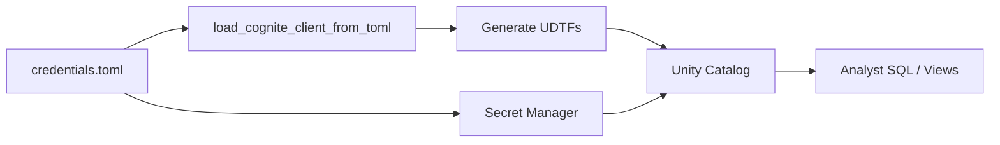

# Private Link and PSaaS Setup

This guide explains CDF **base URL** configuration for **cognite-databricks** and **cognite-pygen-spark**, with setup details for deployments that require a custom `base_url` in TOML.

## CDF base URL

How you connect to CDF depends on your deployment type. See [Clusters and regions](https://docs.cognite.com/cdf/admin/clusters_regions#clusters-and-regions) for the official cluster documentation.

### 1. Multi-tenant cluster

Your organization runs on a **shared** Cognite cluster alongside other tenants. Choose a cluster from the [published multi-tenant list](https://docs.cognite.com/cdf/admin/clusters_regions#cognite-multi-tenant-clusters) (for example `westeurope-1`, `az-eastus-1`, or `europe-west1-1`).

| | |
| --- | --- |
| **Base URL** | Listed in the Clusters and regions table (typically `https://{cluster}.cognitedata.com`; some clusters use a different hostname such as `api.cognitedata.com`) |
| **Who provides it** | Cognite — fixed per cluster from the public list |
| **TOML** | Set `cdf_cluster` only — no `base_url` needed |

```toml
[cognite]
project = "your-cdf-project"
tenant_id = "your-azure-ad-tenant-id"
cdf_cluster = "westeurope-1"
client_id = "your-oauth2-client-id"
client_secret = "your-oauth2-client-secret"
```

### 2. Dedicated cluster

Your organization uses **exclusive** cloud storage and compute on a Cognite-managed dedicated cluster. Request a dedicated cluster through your Cognite representative.

| | |
| --- | --- |
| **Base URL** | Customer-specific hostname **provided by Cognite** (not on the public multi-tenant list) |
| **Who provides it** | Cognite — assigned to your organization |
| **TOML** | Set `cdf_cluster` **and** `base_url` with the URL Cognite gives you |

```toml
[cognite]
project = "your-cdf-project"
tenant_id = "your-azure-ad-tenant-id"
cdf_cluster = "westeurope-1"
base_url = "https://<your-dedicated-cluster-hostname>.cognitedata.com"
client_id = "your-oauth2-client-id"
client_secret = "your-oauth2-client-secret"
```

### 3. PSaaS / Private Link

**Private SaaS (PSaaS)** and **Private Link** use a **Cognite-provided** per-customer hostname that is **wired into your VPN or private network setup**. API traffic reaches CDF through your private connectivity instead of the shared public cluster URL.

Typical hostname format:

`p001.plink.az-xyz-001.cognitedata.com`

| | |
| --- | --- |
| **Base URL** | Cognite-provided Private Link hostname (for example `https://p001.plink.az-xyz-001.cognitedata.com`) |
| **Who provides it** | Cognite assigns the URL; you integrate it with your VPN / Private Link configuration |
| **TOML** | Set `cdf_cluster` to your cluster name (for OAuth) **and** `base_url` to the Cognite-provided Private Link URL |

```toml
[cognite]
project = "your-cdf-project"
tenant_id = "your-azure-ad-tenant-id"
cdf_cluster = "az-xyz-001"
base_url = "https://p001.plink.az-xyz-001.cognitedata.com"
client_id = "your-oauth2-client-id"
client_secret = "your-oauth2-client-secret"
```

For Private Link setup, see:

- [Configure Private Link on Azure](https://docs.cognite.com/cdf/access/guides/configure_private_link_azure)
- [Configure Private Link on AWS](https://docs.cognite.com/cdf/access/guides/configure_private_link_aws)

### Summary

| Deployment | Base URL source | `cdf_cluster` in TOML | `base_url` in TOML |
| --- | --- | --- | --- |
| **Multi-tenant** | [Published cluster list](https://docs.cognite.com/cdf/admin/clusters_regions#cognite-multi-tenant-clusters) | Required | Not needed |
| **Dedicated** | Cognite-provided, customer-specific | Required | Required |
| **PSaaS / Private Link** | Cognite-provided; routed via customer VPN | Required | Required |

**cognite-pygen 1.3.0+** reads optional `base_url` from TOML (and supports `--cdf-url` on the CLI) for dedicated, PSaaS, and Private Link deployments. OAuth scopes still derive from `cdf_cluster`; `base_url` overrides where API requests are sent.

## When you need this guide

Multi-tenant customers only need `cdf_cluster` — follow the [catalog quickstart](./catalog_based/quickstart.md).

This guide focuses on **dedicated**, **PSaaS**, and **Private Link** setups that require `base_url` in TOML.

## Deploying with a TOML file

The TOML file is an **admin-only provisioning artifact**. It is read during setup to connect to CDF, generate UDTFs, and (for Databricks) seed Secret Manager. **Analysts do not use the TOML file at query time.**



| Phase | Who runs it | Uses TOML? | What happens |
| --- | --- | --- | --- |
| **1. Prepare config** | Platform admin | Create file | Store `[cognite]` credentials (+ `base_url` for PSaaS/Private Link) in the workspace |
| **2. Install packages** | Platform admin | No | `%pip install cognite-databricks` (and `cognite-pygen>=1.3.0`) |
| **3. Connect to CDF** | Platform admin | **Yes** | `load_cognite_client_from_toml()` — uses `base_url` when set |
| **4. Generate UDTFs** | Platform admin | Indirectly | Client from step 3 fetches the data model and writes Python UDTF files |
| **5. Seed secrets** | Platform admin | **Yes** | Read TOML again; copy fields into Databricks Secret Manager (`base_url` is **not** stored) |
| **6. Register** | Platform admin | No | `register_udtfs` / `register_views` reference secrets via `SECRET()` |
| **7. Query** | Analysts | **No** | SQL against Views; credentials resolved from Secret Manager |

Store the file outside version control, for example:

`/Workspace/Users/<your-email>/config/credentials.toml`

Use [`example_config_private_link.toml`](./catalog_based/example_config_private_link.toml) for PSaaS / Private Link.

---

## cognite-databricks deployment (step by step)

Full catalog-based flow with TOML. For the standard multi-tenant path, see the [catalog quickstart](./catalog_based/quickstart.md) — the steps are the same; only the TOML content differs when `base_url` is required.

### Step 1 — Install

```python
%pip install --upgrade "cognite-databricks>=0.3.1" "cognite-pygen>=1.3.0"
```

Restart the kernel if prompted.

### Step 2 — Load client from TOML

The TOML drives the **first** connection to CDF. For PSaaS / Private Link, `base_url` must be present so provisioning traffic uses your VPN-routed hostname.

```python
from cognite.databricks import generate_udtf_notebook
from cognite.client.data_classes.data_modeling.ids import DataModelId
from cognite.pygen import load_cognite_client_from_toml
from databricks.sdk import WorkspaceClient

import toml

toml_file_path = "/Workspace/Users/<your-email>/config/credentials.toml"

client = load_cognite_client_from_toml(toml_file_path)
client.iam.token.inspect()  # sanity check against your base_url
```

### Step 3 — Generate UDTF Python files

The client loaded from TOML is passed into the generator. Codegen talks to CDF through `base_url` (when set) to read your data model.

```python
workspace_client = WorkspaceClient()
warehouses = list(workspace_client.warehouses.list())
warehouse = warehouses[0]

data_model_id = DataModelId(space="cdf_cdm", external_id="CogniteCore", version="v1")

generator = generate_udtf_notebook(
    data_model_id,
    client,
    workspace_client=workspace_client,
    output_dir="/Workspace/Users/<your-email>/udtf_generated",
    catalog="my_catalog",
    schema="CDF_CogniteCore_v1",
    warehouse_id=warehouse.id,
)
```

### Step 4 — Copy TOML credentials into Secret Manager

Re-read the TOML and push **individual secret keys** into Databricks. This is a one-time handoff: after registration, the notebook no longer needs the TOML for queries.

`base_url` is **not** copied to Secret Manager — only `project`, `cdf_cluster`, `client_id`, `client_secret`, and `tenant_id`.

```python
secret_scope = f"cdf_{data_model_id.space}_{data_model_id.external_id.lower()}"

toml_content = toml.load(toml_file_path)
cognite_config = toml_content["cognite"]

generator.secret_helper.set_cdf_credentials(
    scope_name=secret_scope,
    project=cognite_config["project"],
    cdf_cluster=cognite_config["cdf_cluster"],
    client_id=cognite_config["client_id"],
    client_secret=cognite_config["client_secret"],
    tenant_id=cognite_config["tenant_id"],
)
```

### Step 5 — Register UDTFs and Views

Registration uses **Secret Manager**, not the TOML file. Generated SQL embeds `SECRET('cdf_…', 'client_id')` references.

```python
generator.register_udtfs(secret_scope=secret_scope, if_exists="replace")
generator.register_views(secret_scope=secret_scope, if_exists="replace")
```

### Step 6 — Query (no TOML)

Analysts query Views without touching the TOML file:

```sql
SELECT * FROM my_catalog.CDF_CogniteCore_v1.my_view;
```

Under the hood, the View passes `SECRET('cdf_…', …)` values into the UDTF.

### What the TOML is (and is not) used for

| TOML field | Provisioning (`load_cognite_client_from_toml`) | Secret Manager | UDTF query time |
| --- | --- | --- | --- |
| `project` | Yes | Stored | Via `SECRET()` |
| `cdf_cluster` | Yes (OAuth scopes) | Stored | Via `SECRET()` |
| `client_id` / `client_secret` / `tenant_id` | Yes | Stored | Via `SECRET()` |
| `base_url` | Yes (API endpoint) | **Not stored** | Not used today — see [Query-time behavior](#query-time-behavior-udtfs) |

---

## Requirements

| Package | Minimum version | Role |
| --- | --- | --- |
| `cognite-pygen` | **1.3.0** | `load_cognite_client_from_toml()` reads `base_url` from TOML |
| `cognite-pygen-spark` | **0.3.1** | UDTF code generation (used by cognite-databricks) |
| `cognite-databricks` | **0.3.1** | Databricks registration; depends on pygen ≥ 1.3.0 |

## TOML configuration reference

Add `base_url` to the `[cognite]` section for dedicated, PSaaS, or Private Link deployments:

```toml
# Private Link / PSaaS example — do not commit secrets.
[cognite]
project = "your-cdf-project"
tenant_id = "your-azure-ad-tenant-id"
cdf_cluster = "az-xyz-001"
client_id = "your-oauth2-client-id"
client_secret = "your-oauth2-client-secret"
base_url = "https://p001.plink.az-xyz-001.cognitedata.com"
```

| Field | Required | Description |
| --- | --- | --- |
| `cdf_cluster` | Yes | Cluster name (e.g. `az-xyz-001`). Used for OAuth scopes: `https://{cdf_cluster}.cognitedata.com/.default` |
| `base_url` | Dedicated / PSaaS / Private Link | Cognite-provided URL (with `https://`). Routed via VPN for PSaaS/Private Link |
| `project`, `tenant_id`, `client_id`, `client_secret` | Yes | Same as standard setups |

Example file: [`docs/catalog_based/example_config_private_link.toml`](./catalog_based/example_config_private_link.toml).

### How `load_cognite_client_from_toml` applies `base_url`

```python
base_url = toml_content.pop("base_url", None)
client = CogniteClient.default_oauth_client_credentials(**toml_content)
if base_url:
    client.config.base_url = base_url
```

Omitting `base_url` preserves the default public URL behavior.

### Query-time behavior (UDTFs)

Generated UDTFs build API URLs as `https://{cdf_cluster}.cognitedata.com` from Secret Manager values. `base_url` from TOML is **not** stored in secrets and is **not** used at query time today.

| Phase | `base_url` support | Notes |
| --- | --- | --- |
| **Provisioning** (TOML → `load_cognite_client_from_toml`) | Yes | Use `base_url` in TOML |
| **Query time** (UDTF via `SECRET('…', 'cdf_cluster')`) | Public URL pattern only | Ensure workers can reach the endpoint UDTFs resolve |

If workers can only reach CDF through Private Link at query time, contact your Cognite team — runtime `base_url` in Secret Manager is on the roadmap.

---

## cognite-pygen-spark deployment (step by step)

Standalone Spark clusters use the same TOML for **code generation only**. There is no Secret Manager — credentials are passed into SQL when querying UDTFs.

| Phase | Uses TOML? |
| --- | --- |
| Install + generate UDTFs | **Yes** — `load_cognite_client_from_toml("config.toml")` |
| Register UDTFs in Spark session | No — register generated Python modules |
| Query UDTFs | No — pass credential values in SQL (often read from TOML once in the notebook) |

### Step 1 — Install

```bash
pip install --upgrade "cognite-pygen-spark>=0.3.1" "cognite-pygen>=1.3.0"
```

Ensure `cognite-sdk` is available on all Spark worker nodes.

### Step 2 — Generate from TOML

```python
from pathlib import Path

from cognite.client.data_classes.data_modeling.ids import DataModelId
from cognite.pygen import load_cognite_client_from_toml
from cognite.pygen_spark import SparkUDTFGenerator

client = load_cognite_client_from_toml("config.toml")
client.iam.token.inspect()

generator = SparkUDTFGenerator(
    client=client,
    output_dir=Path("./generated_udtfs"),
    data_model=DataModelId(space="my_space", external_id="MyModel", version="1"),
    top_level_package="cognite_udtfs",
)
result = generator.generate_udtfs()
```

### Step 3 — Register and query

Register the generated UDTF classes in your Spark session, then query with credentials as SQL parameters. You can read values from the same TOML in your driver notebook — the TOML is not read automatically at query time.

```python
import toml

config = toml.load("config.toml")["cognite"]
# Use config["client_id"], config["cdf_cluster"], etc. when building SQL or calling the UDTF
```

See [Generation](https://github.com/cognitedata/pygen-spark/blob/main/docs/guide/generation.md) and [Registration](https://github.com/cognitedata/pygen-spark/blob/main/docs/guide/registration.md).

### `CDFConnectionConfig` vs `load_cognite_client_from_toml`

`CDFConnectionConfig.from_toml()` does not read `base_url`. For PSaaS / Private Link, always use `load_cognite_client_from_toml()`.

---

## pygen CLI (`--cdf-url`)

When using the **pygen** CLI directly (without Databricks), pass the Private Link URL:

```bash
pygen generate \
  --space my_space \
  --external-id MyModel \
  --version 1 \
  --tenant-id <tenant-id> \
  --client-id <client-id> \
  --client-secret <client-secret> \
  --cdf-cluster az-xyz-001 \
  --cdf-url https://p001.plink.az-xyz-001.cognitedata.com \
  --cdf-project my-project
```

`--cdf-cluster` remains the public cluster name; `--cdf-url` overrides the API `base_url`.

---

## Troubleshooting

### `403` — Traffic from this source is forbidden

You are hitting the **public** CDF endpoint from a network that must use Private Link. Add `base_url` to your TOML (provisioning) or verify network routing (query time).

### `TypeError` — unexpected keyword argument `base_url`

Upgrade **cognite-pygen** to 1.3.0 or later:

```python
%pip install --upgrade "cognite-pygen>=1.3.0"
```

### OAuth succeeds but API calls fail (or vice versa)

Confirm:

- `cdf_cluster` is the **public** cluster name (used for scopes).
- `base_url` is the full Private Link URL including `https://`.
- Your Azure AD app is registered against the correct CDF resource (see Cognite Private Link setup docs).

### Provisioning works; UDTF queries fail

Provisioning uses `load_cognite_client_from_toml` (`base_url` aware). UDTF queries use `cdf_cluster` from secrets and the public URL pattern — see [Query-time behavior](#query-time-behavior-udtfs) above.

---

## Related documentation

- [Clusters and regions](https://docs.cognite.com/cdf/admin/clusters_regions#clusters-and-regions) — standard CDF base URLs by cluster
- [Catalog-based quickstart](./catalog_based/quickstart.md)
- [Prerequisites](./catalog_based/prerequisites.md)
- [Secret Manager](./catalog_based/secret_manager.md)
- [pygen-spark Private Link guide](https://github.com/cognitedata/pygen-spark/blob/main/docs/guide/private_link_psaas.md)
- [cognite-pygen 1.3.0 release](https://github.com/cognitedata/pygen/releases/tag/1.3.0)
